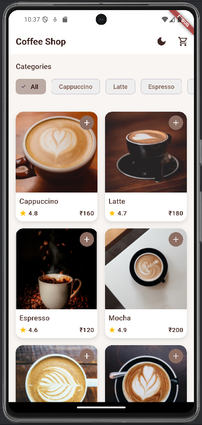
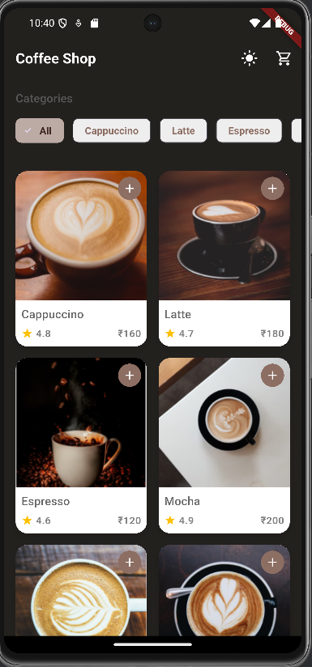
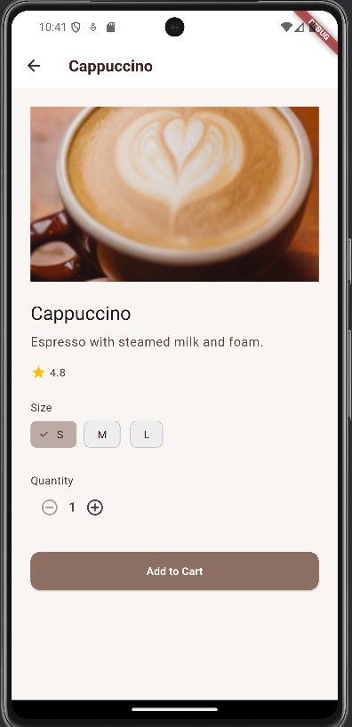

# ☕ Coffee Shop App

A beautiful, modern Flutter application for discovering, exploring, and ordering your favorite coffee drinks.  
Built with clean architecture, adaptive dark/light themes, and a smooth user experience.

---

## 🚀 Features

- **Browse Coffees:**  
  Explore a curated selection of coffee drinks with stunning images and ratings.

- **Categories:**  
  Filter coffees by type (Cappuccino, Latte, Espresso, and more).

- **Product Details:**  
  Tap on any coffee to view detailed information, including description, rating, and price.

- **Cart Functionality:**  
  Add your favorite coffees to the cart and review your order before checkout.

- **Authentication:**  
  Secure login screen for a personalized experience.

- **Dark & Light Mode:**  
  Toggle between beautiful light and dark themes with a single tap.

- **Responsive UI:**  
  Looks great on all devices, with smooth animations and adaptive layouts.

---

## 🖼️ Screenshots

|                Home (Light)                 |                Home (Dark)                |              Product Details               |
| :-----------------------------------------: | :---------------------------------------: | :----------------------------------------: |
|  |  |  |

---

## Figma Reference

https://www.figma.com/design/dFYPpHoAiS25yxVaOV701e/Coffee-Shop-Mobile-App-Design--Community-?node-id=0-1

---

## 🛠️ Setup

1. **Clone the repository:**

   ```bash
   git clone https://github.com/AaKaShhhhhhhhh/coffee_shop_app.git
   cd coffee_shop_app
   ```

2. **Install dependencies:**

   ```bash
   flutter pub get
   ```

3. **Run the app:**
   ```bash
   flutter run
   ```

---

## 🏗️ Project Structure

```
coffee_shop_app/
├── lib/
│   ├── main.dart                # Entry point of the app
│   ├── api/                     # API client and services
│   ├── models/                  # Data models
│   ├── screens/                 # UI screens
│   ├── states/                  # State management
│   ├── theme/                   # App themes
│   └── widgets/                 # Reusable widgets
├── assets/                      # Static assets (images, icons, etc.)
├── android/                     # Android-specific files
├── ios/                         # iOS-specific files
├── test/                        # Unit and widget tests
└── README.md                    # Project documentation
```

---

## 🏗️ Architecture Decisions

- **State Management:**
  Utilizes `ChangeNotifier` for managing app-wide states like authentication, cart, and theme.

- **Theme Support:**
  Implements adaptive light and dark themes using `ThemeData`.

- **Navigation:**
  Uses `Navigator` for screen transitions and route management.

- **Responsive Design:**
  Ensures the app looks great on all devices with adaptive layouts and scalable widgets.

- **Clean Architecture:**
  Separates concerns into layers: API, Models, Screens, States, and Widgets.

## 📧 Contact

For any inquiries or feedback, please reach out to:

- **Email:** aakashkamal47@gmail.com
- **GitHub:** https://github.com/AaKaShhhhhhhhh
- **Twitter:** @aakash\_\_kamal
